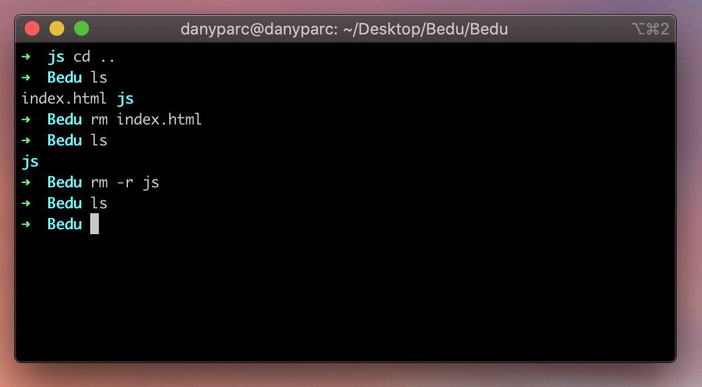

# Navegación (File system)

Para navegar en nuestro sistema de archivos de nuestro sistema operativo podemos utilizar los siguientes comandos

### ls

lista el contenido del directorio dónde estamos posicionados.

### cd

Nos permite posicionarnos en una ruta en específico, o *entrar* en una carpeta. 

**Sintaxis básica:** `cd [ruta o nombre de la carpeta]` 

Para volver volver atrás en una ruta utilizamos `cd ..` 

En windows los comandos tienen diversas variaciones. Si tienes problemas basta con googlear para buscar su equivalente.

### mkdir

Crea una nueva carpeta.

**Sintaxis básica:** `mkdir [nombre carpeta]`

## rm

eliminar archivos/directorios

### touch

Crea un nuevo archivo.

**Sintaxis básica:** `touch [nombre del archivo con extensión]`

## cp

Copia un nuevo archivo.

**Sintaxis básica:** `cp [ruta del archivo a copiar] [nueva ruta]`

## mv

Mover o renombrar archivos.

**Sintaxis básica:** `mv [ruta del archivo] [nueva ruta / nuevo nombre]`

## rm

Eliminar un archivo. Con la opción `-r` podemos también eliminar folders y sus contenidos de manera *recursiva.*

**Sintaxis básica:** `rm [opciones] [ruta del archivo]`

## man

Despliega información del manual de algún comando

**Sintaxis Básica:** `man [nombre del comando]`

El siguiente ejemplo `man man` despliega el manual del mismo comando `man` 

Otros ejemplos:

- `man rm`
- `man ifconfig`

[Reto 1](img/Reto%201%20cb33301dd4f642598de5e30ab33a761c.md)