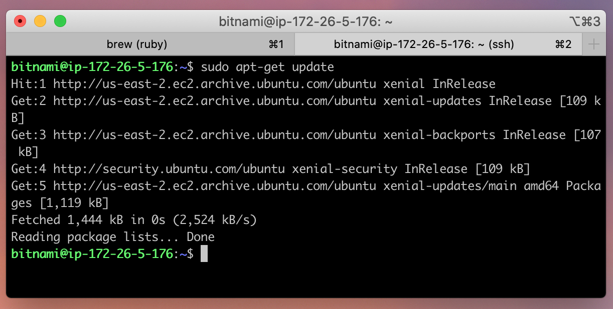
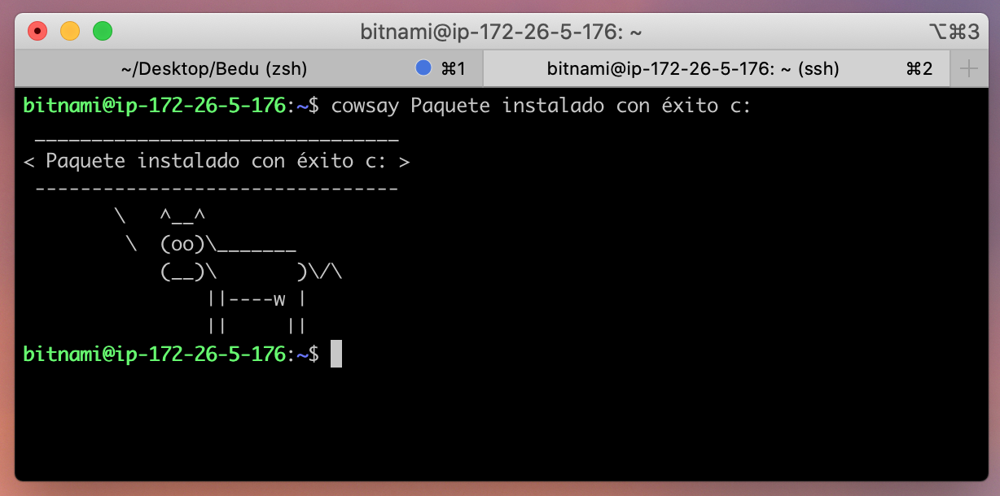

[`Backend Fundamentals`](../../README.md) > [`Sesión 01: Consola`](../README.md) `Ejemplo 03`

# Instalando paquetes

- Los paquetes en los sitemas operativos unix, son **programas** que han sido empaquetados para su instalación y distribución.
- Distribuciones de Linux como Ubuntu y Debian cuentan con su gestor de paquetes por defecto.
- Para MacOs debemos **instalar Brew** siguiendo las instrucciones del [siguiente enlace](https://brew.sh/index_es)

## Actualizando la lista de repositorios

- Para actualizar la fuente oficial de dónde se descargaran los paquetes utilizaremos el **siguiente comando:**

`sudo apt-get update`

Al utilizar el prefijo **sudo**, estamos dando el permiso a nuestro gestor de paquetes de **hacer cambios en nuestro sistema**

>💡**Nota:**
>
>Es posible que nos solicite nuestra contraseña.

## Instalando paquetes

**Sintaxis:**

`[sudo] apt-get install [nombre del paquete o paquetes separados por espacio]`

**Instalaremos** un paquete simple llamado cowsay ejecutando el siguiente comando:

`sudo apt-get install cowsay`

En caso de que nos pida **confirmación para continuar ingresaremos la opción**  `Y` y presionamos **enter.**

si todo ha sido exitoso ahora tendremos un nuevo ***comando*** instalado en nuestra terminal el cual ejecutaremos de la siguiente manera:

**Sintaxis:**

`cowsay [mensaje]`

-------

[`Siguiente: Reto-03`](../Reto-03)
