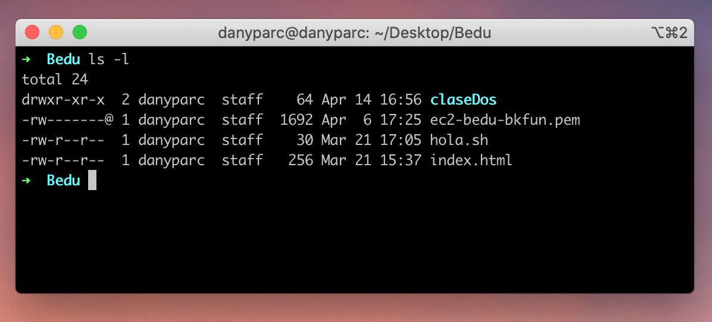

# Ejemplo 1: Usuarios y permisos

## Objetivo

Conocer los distintos tipos de usuarios de un sistema operativo UNIX, entender los diferentes tipos de permisos de un archivo y cómo modificarlos.

## Requerimientos

Tener instalado sistema operativo Linux, o MacOS.

## Desarrollo

En UNIX contamos con los siguientes tipos de usuarios de archivos

[Tipos de usuarios](src/Tipos%20de%20usuarios%204f66ffc3bf854dbda09149dedd293edb.csv)

Cada uno de estos usuarios tiene un tipo de permiso específico sobre cada archivo. 

Los permisos son:

- `r`: Lectura (**r**ead)
- `w`: Escritura (**w**rite)
- `x`: Ejecución (e**x**ecute)

## Iniciando sesión como usuario root

Para cambiar los privilegios y propietarios de nuestros archivos necesitamos los permisos suficientes.

Para esto necesitamos autentificarnos cómo usuarios root

Para iniciar sesión en ubuntu con usuario root ingresaremos el siguiente comando:

`su -` 

seguido de nuestro password si este es requerido.

**Cuidado:** Al estar autenticados cómo usuarios root podemos modificar contaremos con todos los privilegios, así que podremos hacer CUALQUIER modificación al sistema operativo.

Podemos salir de la sesión escribiendo la palabra `exit` y dando enter.

## Listando privilegios en los archivos

Cada archivo tiene un tipo de acceso para cada usuario.

Entraremos a nuestra carpeta Bedu de los anteriores ejemplo y ejecutaremos el comando:

`ls -l`



Cómo ejemplo utilizaremos los valores del archivo `hola.sh` (fila 3)

- **-rw-r--r--** En la primera columna obtendremos una representación de los bits de permisos cuyo primer caracter nos indica el tipo de archivo puede ser folder `d`, archivo regular `-`, o *symbolic link* `l`, los siguientes 3 caracteres serán los permisos que el propietario tiene sobre ese archivo, luego los permisos del grupo y al final los permisos globales.
- **1** – Una cantidad de enlaces fijos (hard links). Básicamente, un enlace fijo es un nombre adicional para un archivo existente.
- **danyparc staff** – Muestra el propietario y el propietario del grupo del archivo.
- **30** – Esto muestra el tamaño del archivo.
- **Mar 21 27:05** – Muestra la fecha de la última modificación.
- **hola.sh** – Proporciona el nombre del archivo/carpeta.


El comando `chown` nos permite cambiar al propietario de un archivo

**Sintaxis:** `chown [owner/group owner] [nombre del archivo]`

Si tenemos un archivo «demo.txt» y queremos que el propietario del archivo sea «juan» y que el propietario del grupo sea «clientes», usaríamos este comando:

```
chown juan:clientes demo.txt
```

## Cambiando privilegios de un archivo

El comando `chmod` nos permite cambiar los privilegios a los archivos. 

Cada tipo de permiso tiene su propio **número**:

- **r** (read) – 4
- **w** (write) – 2
- **x** (execute) – 1

estos valores numéricos se suman para asignar permisos a un tipo de usuario.

Entonces, para cambiar los permisos de **hola.sh** a estos:

**-rwxr–rw- 1 danyparc staff 0 Mar 21 27:05 hola.sh**

Ejecutaremos este comando:

```bash
chmod 746 hola.sh
```

Donde 7 es la suma de los valores numéricos de los permisos para el propietario, 4 para el grupo y 6 para el público en general. Así que tendríamos un archivo dónde el propietario tiene todos los permisos, el grupo solamente puede leer y otros únicamente pueden leer y escribir.

Si quisieramos cambiar los permisos de un folder junto con todos los archivos que contiene, podemos utilizar la opción `-R` para aplicar el comando de manera recursiva. 

```bash
chmod -R 744 claseDos
```

# Reto 1

1. Listar los permisos actuales de tus archivos
2. Cambiar los permisos del archivo `index.html` a la estructura `-rwxr-xr--` 
3. cambiar los permisos del archivo `hola.sh` a la estructura `-rwxrwxrwx`
4. Regresar los archivos a su estructura inicial de permisos