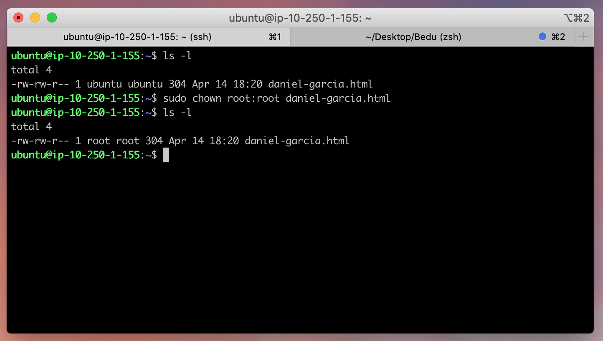

# Ejemplo 3: Utilizando el servidor remoto

## Objetivo

Utilizar el servidor remoto al que hemos accesado con los comandos aprendidos de ubuntu.

## Requisitos

El experto debe proveer un servidor con Apache corriendo y con una dirección o ip pública, así cómo  las respectivas credenciales.

El alumno ya debe estar conectado al servidor remoto.

## Desarrollo

1. Una vez dentro del servidor crearemos un archivo con nuestro nombre y la extensión html 

`touch [mi_nombre].html`

2. Abrimos el archivo con nano o vim y pegamos el siguiente contenido:

```html
<!DOCTYPE html>
<html lang="en">
<head>
  <meta charset="UTF-8">
  <meta name="viewport" content="width=device-width, initial-scale=1.0">
  <title>[tu nombre]</title>
</head>
<body>
	 <h1>¡Hola! soy [tu nombre]</h1> 
	<p>Bienvenido a la soberana república soviética de mi website</p>
</body>
</html>
```

no olvides editarlo con tu nombre y guardar los cambios.

3. Cambiaremos al propietario del archivo con el comando 

`sudo chown root:root [mi-nombre].html`



4. Cambiaremos los permisos del archivo para asegurarnos de que solo el usuario root lo pueda modificar

`sudo chmod 644 [mi-nombre].html`


5. Ahora moveremos este archivo a la ruta `/var/www/html` con el comando mv y con permisos root:

`sudo mv daniel-garcia.html /var/www/html/`

6. Si todo ha salido bien pediremos la url pública de nuestro servidor y entraremos a ella agregando el nombre de nuestro archivo a la ruta.

**Ejemplo:** [http://ec2-52-43-163-239.us-west-2.compute.amazonaws.com/daniel-garcia.html](http://ec2-52-43-163-239.us-west-2.compute.amazonaws.com/daniel-garcia.html)

Esto renderizará nuestro archivo html


Para salir del servidor y cerrar la conexión ejecutaremos el comando `exit`