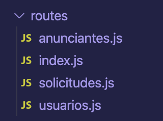

[`Backend Fundamentals`](../../README.md) > [`Sesión 04: API`](../README.md) > `Ejemplo 3`

# Ejemplo 3

## Objetivo

Comprender el concepto de rutas en nuestra API y la mejor manera de establecerlas para acceder a recursos.

## Requerimientos

Se recomienda tener NodeJS LTS y ExpressJS.

## Desarrollo

### Configurando las rutas de nuestra API

### Creando la estructura de un CRUD

En los siguientes pasos crearemos el **esqueleto** de nuestra API para el recurso `usuarios`, declarando las rutas para crear, obtener, actualizar y eliminar usuarios (CRUD).

Los siguientes *endpoints* estarán siendo importados en el archivo `index.js` y bajo la ruta `v1/usuarios` de nuestra api.

1. Debajo de la carpeta routes, crea el archivo `usuarios.js`, agrega la siguiente estructura:

```jsx
// Estructura del CRUD
const router = require('express').Router();
const {
  crearUsuario,
  obtenerUsuarios,
  modificarUsuario,
  eliminarUsuario
} = require('../controllers/usuarios')

router.get('/', obtenerUsuarios)
router.post('/', crearUsuario)
router.put('/:id', modificarUsuario)
router.delete('/:id', eliminarUsuario)

module.exports = router;
```

- Lo que aquí sucedió es que hemos externalizado el código de nuestro router a funciones independientes en nuestra carpeta de controladores.

- Aunque para este caso en particular podríamos seguir trabajando con la lógica de cada *endpoint* dentro del archivo `routes/usuarios.js` cuando los proyectos van creciendo, es conveniente modularizar nuestro código, y una manera de hacerlo es externalizando funciones en los controladores.
Para hacer peticiones en una ruta (endpoint) en específico, debemos establecer una estructura específica.

- Para esto utilizaremos el Router que nos provee la librería Express.

2. Dentro de la carpeta routes, crearemos el archivo `index.js` con el siguiente código:

```jsx
var router = require('express').Router();

router.get('/', (req, res)=>{
  res.send('welcome to adoptapet api');
});

module.exports = router;
```
La sintaxis `(req, res) => { ... }` representa una función que será ejecutada cuando llegue alguna petición en las direcciones uri que especificamos, también se le puede llamar ***handler*** o ***callback***. 

3. Ahora modificaremos nuestro archivo `app.js` para agregar esta ruta:

```jsx
var express = require('express'),
    bodyParser = require('body-parser'),
    cors = require('cors');

// Objeto global de la app
var app = express();

// Configuración de middlewares
app.use(cors());
app.use(bodyParser.urlencoded({ extended: false }));
app.use(bodyParser.json());

**// Agregamos el código de nuestro router (routes/index.js)
app.use('/v1', require('./routes'));**

// Interceptando los errores 404
app.use(function(req, res, next) {
  var err = new Error('Not Found');
  err.status = 404;
  next(err);
});

// Iniciando el servidor...
var server = app.listen(process.env.PORT || 3000, function(){
  console.log('Escuchando en el puerto ' + server.address().port);
});
```

Al hacer una petición a esta ruta podremos ver que nos está devolviendo información sobre la versión uno de nuestra API.


Es una buena práctica colocar la versión de nuestra app como una ruta principal, ya que así en un futuro si hay un cambio demasiado grande puede mantenerse funcionando ambas apis y conservar compatibilidad.

4. Debajo de la carpeta `routes`, completa la siguiente estructura:

routes/

anunciantes.js

index.js

solicitudes.js

usuarios.js

mascotas.js



5. En el archivo `index.js` añadiremos lo siguiente

```jsx
var router = require('express').Router();

router.get('/', (req, res)=>{
  res.send('welcome to adoptapet api');
})

router.use('/usuarios', require('./usuarios'));

/* con el método use de nuestro router estamos indicando 
* que en la ruta 'v1/usuarios' estarán anidadas las rutas 
* que vamos a crear en nuestro archivo usuarios.js,
* la función require está importando este archivo */

module.exports = router;
```

No olvides guardar y revisar que tu servidor se haya actualizado y esté corriendo.

[`Atrás: Reto 02`](https://github.com/beduExpert/A2-Backend-Fundamentals-2020/tree/master/Sesion-04/Reto-02) | [`Siguiente: Reto 03`](https://github.com/beduExpert/A2-Backend-Fundamentals-2020/tree/master/Sesion-04/Reto-03)
