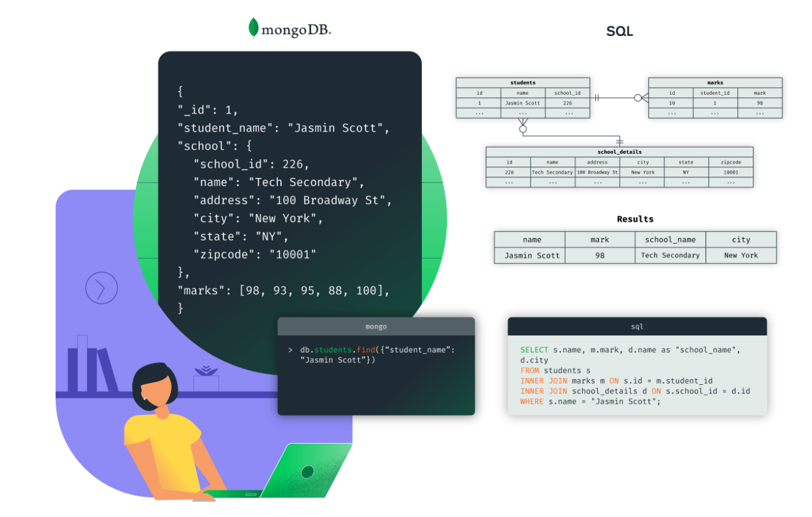
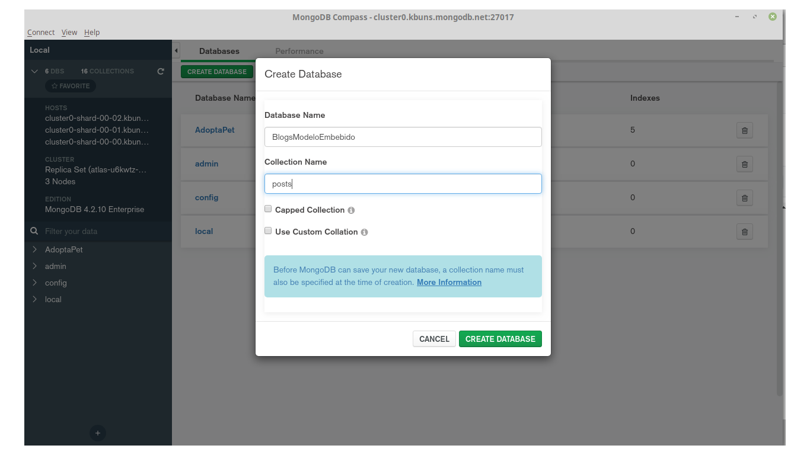
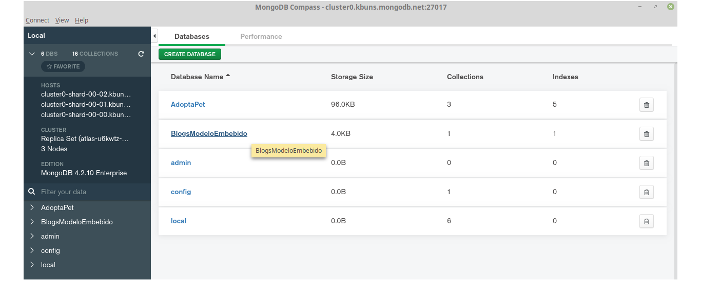
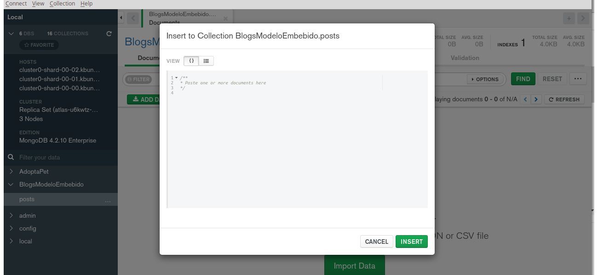
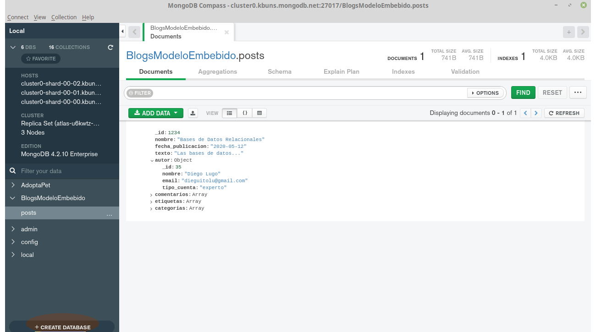
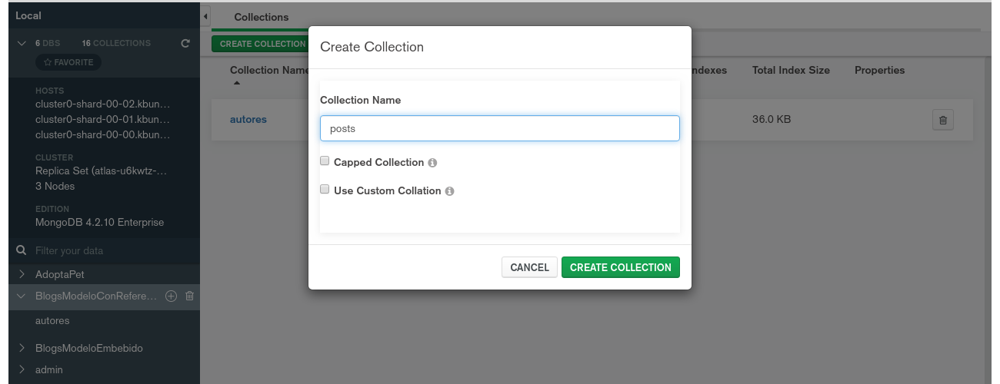
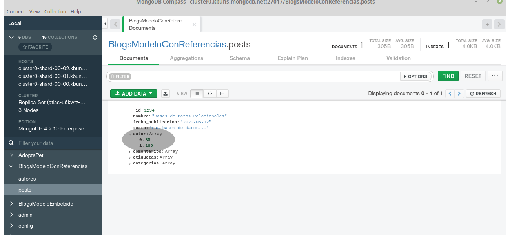

# Ejemplo 2

## Objetivo

Comprender los fundamentos de MongoDB para la implementación de Bases de Datos NoSQL orientada a documentos.

## Requerimientos

Conexión a internet

## Desarrollo

MongoDB es una base de datos NoSQL y orientada a documentos, por lo que, los datos se almacenan como documentos, estos documentos se almacenan en formato JSON.

Veamos un ejemplo muy gráfico:



A su vez, MongoDB almacena los documentos en **colecciones**, veamos una analogía de entre MongoDB y un RDBMS:


### Estructura de un documento en MongoDB

Los documentos en MongoDB están compuesto por pares de campo y valor con la siguientes estructura:

```json
{ 
   "field1": "value1", 
   "field2": "value2", 
   "field3": "value3", 
   ... 
   "fieldN":  "valueN"
}
```

Y el valor de cada campo tiene un tipo de datos, revisa los distintos tipos de datos en MongoDB:

[BSON Types - MongoDB Manual](https://docs.mongodb.com/manual/reference/bson-types/)

### Llave primaria

Cada documento almacenado en MongoDB requiere un campo **_id** único que se identificará como la llave primaria, si omitimos este campo, MongoDB genera automáticamente un **ObjectId** que es un tipo de dato.

La utilización de ObjectId con MongoDB es muy común, ya que, es un tipo de dato pequeño, rápido de generar y ordenado. Su estructura:

- 4 bytes para un valor *timestamp*
- 5 bytes para un valor aleatorio
- 3 bytes para un contador incremental

### Modelado de datos en MongoDB

Los datos en MongoDB tienen un esquema flexible, los documentos en una colección pueden no seguir una misma estructura, por lo que, se debe considerar:

> Normalización y denormalización: Los modelos de datos totalmente normalizados describen las relaciones con referencias entre documentos, mientras que los modelos denormalizados pueden almacenar información redundante a tráves de los modelos relacionados.

- **Modelado Embebido**:

    Permite agregar un documento dentro de un documento, pero no sólo eso, recordemos que también podemos tener *arrays* de documentos. La ventaja de este tipo de modelado es la rapidez para hacer operaciones CRUD, además, son menos costosas.

    Se puede usar cuando: 

    - Se tiene relaciones *Uno a uno* entre documentos. Ve más detalles en [Model One-to-One Relationships with Embedded Documents](https://docs.mongodb.com/manual/tutorial/model-embedded-one-to-one-relationships-between-documents/#data-modeling-example-one-to-one)

    - Ilustrando esta relación con un ejemplo de MongoDB:

         ```json
         {
            "_id": "joe",
               "name": "Joe Bookreader",
               "address": {
               "street": "123 Fake Street",
               "city": "Faketon",
               "state": "MA",
               "zip": "12345"
            }
         }
         ```

   - Se tiene relaciones *Uno a muchos.* Ve más detalles en [Model One-to-Many Relationships with Embedded Documents.](https://docs.mongodb.com/manual/tutorial/model-embedded-one-to-many-relationships-between-documents/#data-modeling-example-one-to-many)

   - Ilustrando esta relación con un ejemplo de MongoDB:

        ```json
        {
           "_id": "joe",
           "name": "Joe Bookreader",
           "addresses": [
                {
                    "street": "123 Fake Street",
                    "city": "Faketon",
                    "state": "MA",
                    "zip": "12345"
                },
                {
                    "street": "1 Some Other Street",
                    "city": "Boston",
                    "state": "MA",
                    "zip": "12345"
                }
            ]
         }
        ```

- **Modelado utilizando referencias**

    Es almacenar **referencias** entre documentos para indicar la existencia de una relación entre los datos de cada documento.

    Puede implicar que los queries tengan mayor complejidad, ya que puede ser el caso en el que se tenga que consultar más de una colección.

    Se usa en situaciones:

    - Donde las referencias son más flexibles que los embebidos. Puede haber situaciones en las que conviene tener almacenadas las referencias en lugar de un número ilimitado de documentos y que puede llegar a crecer constantemente. Ver más en [Model One-to-Many Relationships with Document References](https://docs.mongodb.com/manual/tutorial/model-referenced-one-to-many-relationships-between-documents/#data-modeling-publisher-and-books)

        Ilustrando este caso con un ejemplo de MongoDB:

        ```json
        {
           "name": "O'Reilly Media",
           "founded": 1980,
           "location": "CA",
           "books": [123456789, 234567890, ...]

        }

        {
            "_id": 123456789,
            "title": "MongoDB: The Definitive Guide",
            "author": [ "Kristina Chodorow", "Mike Dirolf" ],
            "published_date": ISODate("2010-09-24"),
            "pages": 216,
            "language": "English"
        }

        {
           "_id": 234567890,
           "title": "50 Tips and Tricks for MongoDB Developer",
           "author": "Kristina Chodorow",
           "published_date": ISODate("2011-05-06"),
           "pages": 68,
           "language": "English"
        }
        ```

    - Se tienen relaciones *muchos a muchos*

### Ejemplo

Supongamos una base de datos para una aplicación de blogs, donde es necesario almacenar: usuarios, posts, comentarios, etiquetas, etc.

Vamos a modelar estos documentos de las formas que ya se explicaron; Por el momento utilizarmeos <b>MongoDB Compass</b>, en el siguiente ejemplo estaremos utilizando <b>Mongo Shell</b> para continuar con el modelado.

1. Una vez que lograste conectarte a tu cluster, vamos a crear una nueva base de datos utilizando MongoDB Compass. Da click en <b>CREATE DATABASE</b>


2. En Databas Name, inserta: <b>BlogsModeloEmbebido</b>, en Collation Name, inserta: <b>posts</b>, oprime <b>CREATE DATABASE</b>.



En la lista de Bases de Datos de tu cluster, ya podrás ver la Base de Datos recientemente creda.



3. Selecciona el modelo creado en los puntos anteriores, selecciona la colección <b>posts</b>, oprime <b>ADD DATA</b>, <b>Insert Document</b>. Se abrirá una especie de editor: 



Copia las siguientes líneas en el editor, antes de oprimir <b>INSERT</b>, analiza el código JSON.

```json
{
   "_id": 1234,
   "nombre": "Bases de Datos Relacionales",
   "fecha_publicacion": "2020-05-12",
   "texto": "Las bases de datos...",
   "autor": {
      "_id": 35,
      "nombre": "Diego Lugo",
      "email": "dieguitolu@gmail.com",
      "tipo_cuenta": "experto"
    },
    "comentarios": [
      {   
         "_id": 23456,
         "nombre": "Sergio Medina",
         "email": "sergiomedina@hotmail.com",
         "fecha_publicacion": "2020-05-23",
         "texto": "Excelente post, me ayudo a comprender más...",
         "puntuacion": 5
      },
      {
         "_id": 78901,
         "nombre": "Emmanuel Martínez",
         "email": "emmamtz@gmail.com",
         "fecha_publicacion": "2020-06-01",
         "texto": "Hay ciertos conceptos que no me quedaron claros...",
         "puntuacion": 3
      }
    ],
    "etiquetas": [
      "Bases de Datos Relacionales", "Modelo E/R"
      ],
    "categorias": [
      "TI", "Desarrollo de Software"
     ]
}
```

    Este ejemplo es un documento embebido que contiene todos lo datos a almacenar de un post, podemos notar que en comentarios podemos tener un número ilimitado, dependerá del impacto del post cause a una audiencia interesada, pero más allá de eso podría darse el caso en el que el documento sea demasiado grande y hasta podría alcanzar el límite de almacenamiento de un documento.
    
Después de la inserción, podrás ver el documento con los datos de autor embebidos dentro de su estrucutra:


4. Ahora, vamos a crear una nueva base de datos, está utilizará referencias en lugar del modelo embebido. Da click en <b>CREATE DATABASE</b>:



Inserta el nombre: <b>BlogsModeloConReferencias</b> y Collection Name: <b>autores</b>

5. Selecciona la base de datos recien creada, después selecciona la colección autores.

Inserta los siguientes autores (como lo hicimos en el punto 3 ). Nota: Inserta uno por uno.

```json
{
   "_id": 35,
   "nombre": "Diego Lugo",
   "email": "dieguitolu@gmail.com",
   "tipo_cuenta": "experto"
}
        
{
   "_id": 189,
   "nombre": "Alejandro Martínez",
   "email": "alexmtz@gmail.com",
   "tipo_cuenta": "legendario"
}

{   
   "_id": 23456,
   "nombre": "Sergio Medina",
   "email": "sergiomedina@hotmail.com",
   "tipo_cuenta": "aficionado"
}

{
   "_id": 78901,
   "nombre": "Emmanuel Martínez",
   "email": "emmamtz@gmail.com",
   "tipo_cuenta": "legendario"
}
```


6. Agreguemos una nueva colección al model <b>BlogsModeloConReferencia</b>, llámala <b>posts</b>:



7. En el ejemplo anterior (modelo emebido), definimos que un post sólo pertenece a un autor pero en una aplicación real en un post podría participar más de una persona, por lo que, hay que definir que puede haber más de un autor. 

Tal como lo hiciste en el ejemplo 5, inserta el siguiente documento en la colección <b>posts</b>. 

```json
{
   "_id": 1234,
   "nombre": "Bases de Datos Relacionales",
   "fecha_publicacion": "2020-05-12",
   "texto": "Las bases de datos...",
   "autor": [35, 189],
   "comentarios": [23456, 78901],
   "etiquetas": [
      "Bases de Datos Relacionales", "Modelo E/R"
    ],
    "categorias": [
      "TI", "Desarrollo de Software"
      ]
}
```
Nota: Observa el contenido del campo <b>autor</b>. En el podrás encontrar en un arreglo, los valores correspondientes a los id's de los autores que crearon este post.  (Si revisas la colección autores, podrás encontrar estos id's en diferentes autores). De esta forma estamos referenciando desde la colección <b>posts</b> a los id's de documentos en la colección <b>autores</b>.



8. Agreguemos una nueva colección al model <b>BlogsModeloConReferencia</b>, llámala <b>comentarios</b>, inserta los siguientes documentos:

```json
{
   "_id": 23456,
   "autor": 1001,
   "fecha_publicacion": "2020-05-23",
   "texto": "Excelente post, me ayudo a comprender más...",
   "puntuacion": 5
}
        
{            
   "_id": 78901,
   "autor": 3,
   "fecha_publicacion": "2020-06-01",
   "texto": "Hay ciertos conceptos que no me quedaron claros...",
   "puntuacion": 3
}
```

Nota: Desde la colección <b>posts</b>, estaremos referenciando vía los id's a los comentarios encontrados en la colección <b>comentarios</b>.

[`Atrás: Reto 02`](https://github.com/beduExpert/A2-Backend-Fundamentals-2020/tree/master/Sesion-06/Reto-02) | [`Siguiente: Reto 03`](https://github.com/beduExpert/A2-Backend-Fundamentals-2020/tree/master/Sesion-06/Reto-03)
