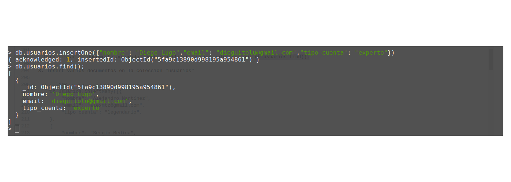
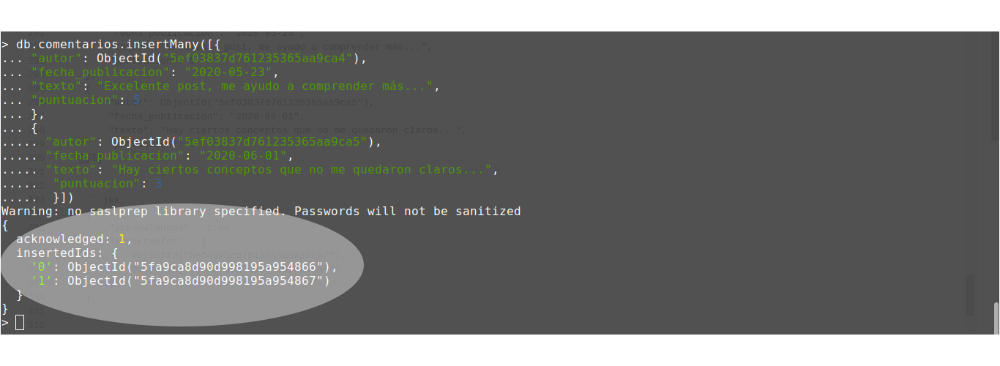

# Ejemplo 3

## Objetivo

Comprender los métodos proporcionados por MongoDB para realizar operaciones CRUD en una bases de datos. 

## Requerimientos

- Conexión a internet
- MongoDB Shell en tu computadora

## Desarrollo

### Inserción de documentos

MongoDB proporciona los siguientes métodos para agregar documentos a una colección:

- db.collection.insertOne()

    ```jsx
    db.collection.insertOne(
       <document>,
       {
          writeConcern: <document>
       }
    )
    ```

- db.collection.insertMany()

    ```jsx
    db.collection.insertMany(
       [ <document 1> , <document 2>, ... ],
       {
          writeConcern: <document>,
          ordered: <boolean>
       }
    )
    ```

💡 Recordando: Si se omite el campo **_id** MongoDB creará uno internamente de tipo **ObjectId**.

### Leer documentos

MongoDB proporciona **find** para leer documentos de una colección:

- db.collection.find()

    ```jsx
    db.collection.find(query, projection)
    ```

    donde:

    - query: Especifica el filtro de selección utilizando operadores.
    - projection: Especifica los campos que se devolverán en los documentos que coinciden con el filtro de consulta.

    **Operadores de consulta básicos**

    Comparación: 

    - $eq: Coincidencias con valores que son iguales a un valor especificado.
    - $gt: Coincidencias con valores mayores a un valor especificado.
    - $gte: Coincidencias con valores mayores o iguales a un valor especificado.
    - $in: Coincidencias con cualquiera de los valores especificados en una matriz.
    - $lt: Coincidencias con valores menores a un valor especificado.
    - $lte: Coincidencias con valores menores o iguales a un valor especificado.
    - $ne: Coincidencias con valores que no son iguales a un valor especificado.
    - $nin: No coincide con ninguno de los valores especificados en una matriz.

    Lógico:

    Tendremos los operadores comunes utilizados en los lenguajes de programación: $and, $not, $nor y $or.

    Elemento:

    - $exists: Coincidencias con documentos que tienen el campo especificado.

    [Query and Projection Operators - MongoDB Manual](https://docs.mongodb.com/manual/reference/operator/query/)

### Actualización de documentos

MongoDB proporciona los siguientes métodos para actualizar datos

- db.collection.updateOne()

    ```jsx
    db.collection.updateOne(
       <filter>,
       <update>,
       {
         upsert: <boolean>,
         writeConcern: <document>,
         collation: <document>,
         arrayFilters: [ <filterdocument1>, ... ],
         hint:  <document|string>        // Available starting in MongoDB 4.2.1
       }
    )
    ```

- db.collection.updateMany()

    ```jsx
    db.collection.updateMany(
       <filter>,
       <update>,
       {
         upsert: <boolean>,
         writeConcern: <document>,
         collation: <document>,
         arrayFilters: [ <filterdocument1>, ... ],
         hint:  <document|string>        // Available starting in MongoDB 4.2.1
       }
    )
    ```

- db.collection.replaceOne()

    ```jsx
    db.collection.replaceOne(
       <filter>,
       <replacement>,
       {
         upsert: <boolean>,
         writeConcern: <document>,
         collation: <document>,
         hint: <document|string>                   // Available starting in 4.2.1
       }
    )
    ```

### Eliminar documentos

MongoDB proporciona los siguientes métodos para eliminar documentos:

- db.collection.deleteOne()

    ```jsx
    db.collection.deleteOne(
       <filter>,
       {
          writeConcern: <document>,
          collation: <document>
       }
    )
    ```

- db.collection.deleteMany()

    ```jsx
    db.collection.deleteMany(
       <filter>,
       {
          writeConcern: <document>,
          collation: <document>
       }
    )
    ```

### Ejemplo

En el ejemplo anterior utilizamos MongoDB Compass. En este ejemplo, estaremos trabjando con <b>MongoDB Shell</b>.

1. Utilizando MongoDB Shell, conéctacte a tu cluster a la base de datos <b>BlogsModeloEmbebido</b>:


2. Utilizaremos las funciones antes listadas, con las cuales haremos operaciones tipo <b>CRUD</b> en nuestra base de datos <b>BlogsModeloEmbebido</b>.

- Crea la colección "usuarios":

    ```jsx
    db.createCollection('usuarios')
    ```

    ```json
    {
    	"ok" : 1,
    	"$clusterTime" : {[`Atrás: Reto-02`](https://github.com/beduExpert/A2-Backend-Fundamentals-2020/tree/master/Sesion-01/Reto-02n)
    		"clusterTime" : Timestamp(1592800772, 5),
    		"signature" : {
    			"hash" : BinData(0,"Cqg3SKYxW90A98A5Xz0qScsRGP0="),
    			"keyId" : NumberLong("6799349003877089281")
    		}
    	},
    	"operationTime" : Timestamp(1592800772, 5)
    }
    ```
- Para comprobar que tu colección se generó, puedes utilizar la siguiente función: <b>db.getCollectionNames();</b>


2. Insertar un documento en la colección de "usuarios"

    ```jsx
    db.usuarios.insertOne({"nombre": "Diego Lugo","email": "dieguitolu@gmail.com","tipo_cuenta": "experto"})
    ```

    ```json
    { acknowledged: 1, insertedId: ObjectId("5fa9c13890d998195a954861") }
    ```
- Para listar el documento agregado, puedes utilizar la siguiente función: <b>db.usuarios.find();</b>



3. Inserta varios documentos en la colección "usuarios"

    ```jsx
    db.usuarios.insertMany([{
        "nombre": "Alejandro Martínez",
        "email": "alexmtz@gmail.com",
        "tipo_cuenta": "legendario",
    },
    {
        "nombre": "Sergio Medina",
        "email": "sergiomedina@hotmail.com",
        "tipo_cuenta": "aficionado"
    },
    {
        "nombre": "Emmanuel Martínez",
        "email": "emmamtz@gmail.com",
        "tipo_cuenta": "legendario"
    }])
    ```

    ```json
    {
    	"acknowledged" : true,
    	"insertedIds" : [
    		ObjectId("5ef03837d761235365aa9ca3"),
    		ObjectId("5ef03837d761235365aa9ca4"),
    		ObjectId("5ef03837d761235365aa9ca5")
    	]
    }
    ```
4. Leer los documentos existentes en la colección <b>usuarios</b>:

    ```jsx
    db.usuarios.find()
    ```

    ```json
    { "_id" : ObjectId("5ef036f1d761235365aa9ca2"), "nombre" : "Diego Lugo", "email" : "dieguitolu@gmail.com", "tipo_cuenta" : "experto" }
    { "_id" : ObjectId("5ef03837d761235365aa9ca3"), "nombre" : "Alejandro Martínez", "email" : "alexmtz@gmail.com", "tipo_cuenta" : "legendario" }
    { "_id" : ObjectId("5ef03837d761235365aa9ca4"), "nombre" : "Sergio Medina", "email" : "sergiomedina@hotmail.com", "tipo_cuenta" : "aficionado" }
    { "_id" : ObjectId("5ef03837d761235365aa9ca5"), "nombre" : "Emmanuel Martínez", "email" : "emmamtz@gmail.com", "tipo_cuenta" : "legendario" }
    ```

5. Despliega los documentos cuyo <b>tipo_cuenta</b> tiene el valor <b>legendario</b>

    ```jsx
    db.usuarios.find({"tipo_cuenta":"legendario"})
    ```

    ```json
    { "_id" : ObjectId("5ef03837d761235365aa9ca3"), "nombre" : "Alejandro Martínez", "email" : "alexmtz@gmail.com", "tipo_cuenta" : "legendario" }
    { "_id" : ObjectId("5ef03837d761235365aa9ca5"), "nombre" : "Emmanuel Martínez", "email" : "emmamtz@gmail.com", "tipo_cuenta" : "legendario" }
    ```

6. Antes de insertar un nuevo documento en la colección <b>posts</b>, se recomienda eliminar vía <b>MongoDB Compass</b>, el documento creado en el <b>Ejemplo 2</b>. 

- Inserta el siguiente documento en la colección <b>posts</b>:

    ```jsx
    db.posts.insertOne({
    "nombre": "Bases de Datos Relacionales",
        "fecha_publicacion": "2020-05-12",
        "texto": "Las bases de datos...",
        "autor": [ObjectId("5ef036f1d761235365aa9ca2"), ObjectId("5ef03837d761235365aa9ca3")],
        "etiquetas": [
            "Bases de Datos Relacionales", "Modelo E/R"
        ],
        "categorias": [
            "TI", "Desarrollo de Software"
        ]
    })
    ```

    ```json
    {
    	"acknowledged" : true,
    	"insertedId" : ObjectId("5ef03c44d761235365aa9ca6")
    }
    ```

- <b>Importante:</b> Para referenciar a este documento posteriormente, guarda el ObjectsId del mismo.

    

7. Inserta documentos en la colección <b>comentarios</b>.

    ```jsx
    db.comentarios.insertMany([{
        "autor": ObjectId("5ef03837d761235365aa9ca4"),
        "fecha_publicacion": "2020-05-23",
        "texto": "Excelente post, me ayudo a comprender más...",
        "puntuacion": 5
    },
    {
        "autor": ObjectId("5ef03837d761235365aa9ca5"),
        "fecha_publicacion": "2020-06-01",
        "texto": "Hay ciertos conceptos que no me quedaron claros...",
        "puntuacion": 3
    }])
    ```

    ```jsx
    {
    	"acknowledged" : true,
    	"insertedIds" : [
    		ObjectId("5ef03e5cd761235365aa9ca7"),
    		ObjectId("5ef03e5cd761235365aa9ca8")
    	]
    }
    ```    

- <b>Importante:</b> Para referenciar a estos documentos posteriormente, guarda los ObjectsId de los mismos. 




8. Actualizar el documento del post creado para agregar las referencias de los comentarios creados. 

<b>OJO:</b>
- Remplaza el <b>ObjectId</b> del post del codigo del ejemplo, por el <b>ObjectId</b> guardado en el punto 6.
- En la función <b>$push</b> que inserta un comentario al arreglo de comentarios del post, remplaza el <b>ObjectId</b> del post del codigo del ejemplo, por el <b>ObjectId</b> guardado en el punto 7.

    ```jsx
    db.posts.updateOne({ _id: ObjectId("5fa9c4cd90d998195a954865")}, {$push: { comentarios: ObjectId("5fa9ca8d90d998195a954866")}})
    ```

    ```json
    {
        acknowledged: 1,
        insertedId: null,
        matchedCount: 1,
        modifiedCount: 1,
        upsertedCount: 0
    }
    ```

    ```jsx
    db.posts.updateOne({ _id: ObjectId("5fa9c4cd90d998195a954865")},{$push:{comentarios: ObjectId("5fa9ca8d90d998195a954867")}})
    ```

    ```json
    {
        acknowledged: 1,
        insertedId: null,
        matchedCount: 1,
        modifiedCount: 1,
        upsertedCount: 0
    }
    ```

9. Utilizando <b>MongoDB Compass</b>, observa el único documento de tipo <b>posts</b> que tienes agregado. Debe de tener un arreglo de comentarios cuyos ObjectId, corresponden a los comentarios agregados en la colección <b>comentarios</b>

10. En <b>MongoDB Shell</b>, con la función find, busca los comentarios publicados en Junio.

    ```jsx
    db.comentarios.find({ fecha_publicacion: { $gte: "2020-06-01", $lt: "2020-07-01" }})
    ```

    ```json
    { "_id" : ObjectId("5ef03e5cd761235365aa9ca8"), "autor" : ObjectId("5ef03837d761235365aa9ca5"), "fecha_publicacion" : "2020-06-01", "texto" : "Hay ciertos conceptos que no me quedaron claros...", "puntuacion" : 3 }
    ```

11. Ahora eliminaremos un comentario del posts exitente en la colección <b>posts</b>

<b>OJO:</b>
- Remplaza el <b>ObjectId</b> del post del codigo del ejemplo, por el <b>ObjectId</b> guardado en el punto 6.
- En la función <b>$pull</b> que elimina un comentario del arreglo de comentarios del post, remplaza el <b>ObjectId</b> del codigo del ejemplo, por el <b>ObjectId</b> guardado en el punto 7.

    1. Eliminar la referencia del comentario en el post

        ```jsx
        db.posts.updateOne({ _id: ObjectId("5fa9c4cd90d998195a954865")},{$pull:{comentarios: ObjectId("5fa9ca8d90d998195a954866")}})
        ```

        ```json
        {
            acknowledged: 1,
            insertedId: null,
            matchedCount: 1,
            modifiedCount: 1,
            upsertedCount: 0
        }
        ```

    2. Ver que los cambios funcionaron

        ```jsx
        db.posts.find({ "_id" : ObjectId("5fa9c4cd90d998195a954865") }, { "_id" : 1, comentarios : 1 })
        ```

        ```json
          [
            {
                _id: ObjectId("5fa9c4cd90d998195a954865"),
                comentarios: [ ObjectId("5fa9ca8d90d998195a954867") ]
            }
          ]
        ```

    3. Eliminar el documento en la colección "comentarios"
 
        ```jsx
        db.comentarios.deleteOne({ _id: ObjectId("5fa9ca8d90d998195a954866") })
        ```
        ```jsx
        { "acknowledged" : true, "deletedCount" : 1 }
        ```

    4. Leer los comentarios actuales

        ```jsx
        db.comentarios.find()
        ```

        ```json
        [
            {
                _id: ObjectId("5fa9ca8d90d998195a954867"),
                autor: ObjectId("5ef03837d761235365aa9ca5"),
                fecha_publicacion: '2020-06-01',
                texto: 'Hay ciertos conceptos que no me quedaron claros...',
                puntuacion: 3
            }
        ]

        ```

[`Atrás: Reto 03`](https://github.com/beduExpert/A2-Backend-Fundamentals-2020/tree/master/Sesion-06/Reto-03) | [`Siguiente: Reto 04`](https://github.com/beduExpert/A2-Backend-Fundamentals-2020/tree/master/Sesion-06/Reto-04)
