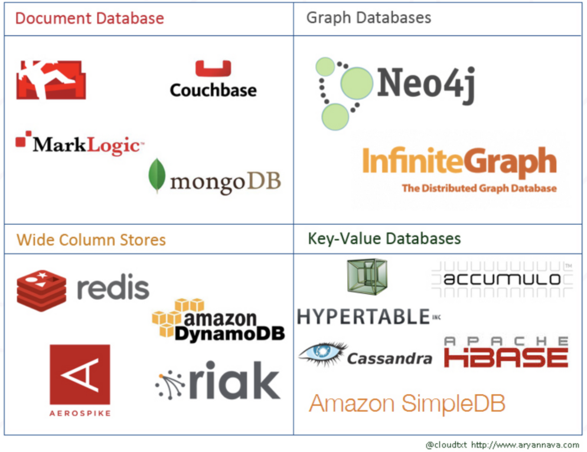

# Prework

## Objetivo

Conocer los fundamentos de las bases de datos no relacionales

## Instrucciones

Ve el siguiente vídeo y lee los artículos, posteriormente contestar el cuestionario adjunto.

## Desarrollo

### Video 1

[que es sql y nosql? cuales son sus diferencias y cuando deberías utilizarlos](https://youtu.be/zmXl2dOGWL8?t=157)

### Artículo 1

[Bases de datos no relacionales | Bases de datos de gráficos | AWS](https://aws.amazon.com/es/nosql/)

### Artículo 2

[¿Cómo saber si necesitas una Base de Datos NoSQL?](https://medium.com/@eugeniomendoza/c%C3%B3mo-saber-si-necesitas-una-base-de-datos-nosql-b6cfd5bb7d9b)

### Bases de Datos NoSQL en el mercado

## Quiz

**¿Una BD relacional puede ser NoSQL?**

**¿Cuáles son las principales características que ofrece las BD NoSQL?**

**¿Cuáles son los tipos de BD NoSQL? Crea un esquema si consideras necesario que te ayude a identificar cada tipo.**

**Si tuvieras que implementar un BD donde la velocidad de lectura y escritura es lo primordial ¿Ocuparías SQL o NoSQL? Justifica tu respuesta.**

**Explica cómo funciona la atomicidad en las BD NoSQL.**