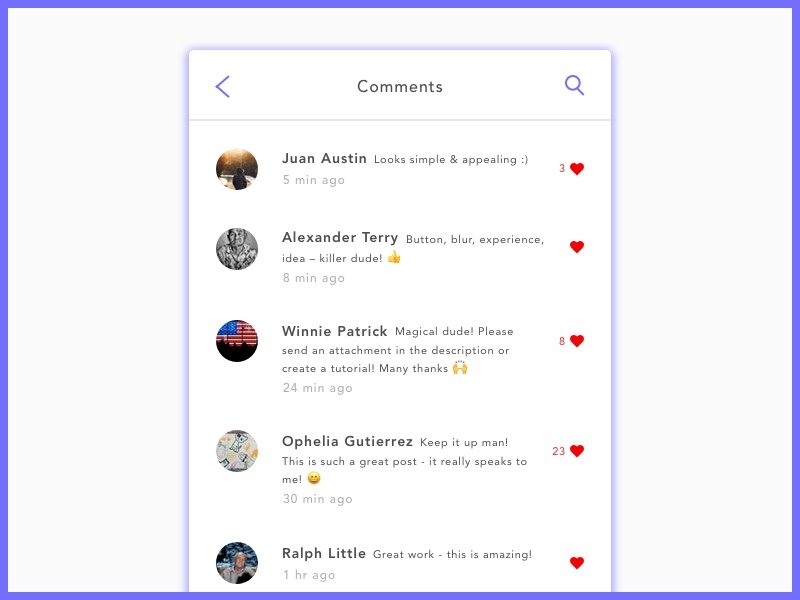

# Postwork

Recuerda que todo lo trabajado en tu prework, así como durante la sesión, puede ser aplicado a tu proyecto personal. Para lo cual, toma las siguientes consideraciones:

Asegurate de comprender:

  - Diferenciar entre el papel que desempeña un Modelo y un Controlador en el patrón de diseño MVC.
  - Para que sirve mongoose.
  - Como generar un Modelo para cada entidad y la importancia de un modelo con mongoose implementado.
  
Analiza las necesidades de tu proyecto personal y aplica los cambios necesarios en tu API para que aproveches los beneficios que te aporta mongoose.

## Objetivo

Desarrollar un nuevo feature sobre el código que se ha trabajado hasta ahora.

## Instrucciones

Lee las indicaciones, escribe los cambios que vas  a hacer en los modelos y plantea pruebas antes de comenzar a codificarlos.

## Desarrolla un nuevo feature para guardar mascotas favoritas

### Requerimientos

Considerando los modelos que has desarrollado en los ejercicios anteriores. 

Desarrolla una nueva característica para que un usuario sea capaz de guardar mascotas que ha visto y que desea adoptar en un futuro.

Esta característica debe incluir:

- Modificaciones al modelo Usuario para soporte de mascotas favoritas
- Endpoint para **agregar** mascota a favoritos.
- Endpoint para **eliminar** mascota de favoritos.
- Endpoint para **listar** favoritos

Como recomendación, escribe las pruebas en un papel o aplicación y plantéate en qué casos se utilizaría del lado del frontend.

**Ej. ¿El anunciante de una mascota debería tener noción de cuántos likes tiene su perrito/gatito?**

Visualiza la interfaz, pensando de manera muy similar al comportamiento de Twitter o Spotify cuando das un like. Tómate la libertad de añadir lo necesario para que esta característica sea de valor para los usuarios.

Crea varios registros de mascotas para hacer pruebas.

Un ejemplo de la interfaz para dar like a comentarios.
