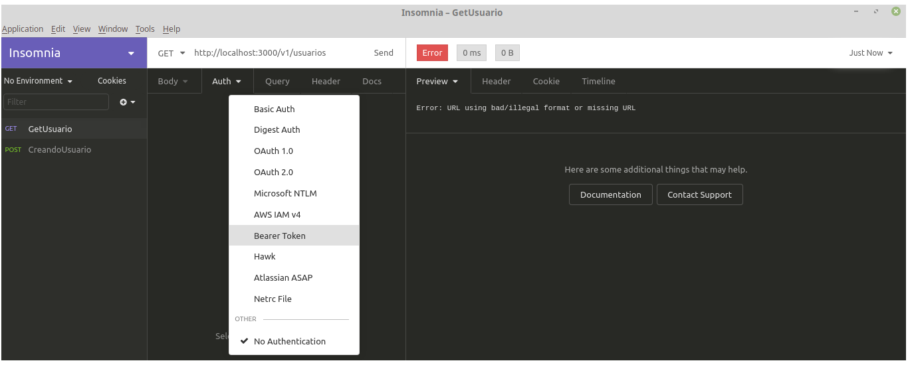

`Backend Fundamentals` > `S07 - Mongoose` 
	
### Reto 1

Es momento de probar los endpoints recien creados en el API, así que ejecuta el servidor y realiza las siguientes tareas.

1. Utilizando insomnia, prueba el endpoint que te permitirá <b>crear una cuenta de usuario en adoptapet</b> ( es decir, en el endpoint `POST [/v1/usuarios](http://localhost:3000/v1/usuarios)` ), guarda el <b>JWT</b> que te devuelve la petición.

 - Puedes utilizar el siguiente ejemplo <b>json</b> como base para hacer tu petición:

		{
			"username":"midory",
			"nombre":"midory",
			"apellido":"romero",
			"email":"midoryr@gmail.com",
    			"password":"midory",
			"ubicacion":"cdmx",	
			"telefono":"3312333",
			"bio":"constante anunciante",
			"foto":""
    			"tipo":"anunciante"
		}  

- No olvides guardar el <b>JWT</b>:

 

2. Ahora prueba el endpoint para obtener la información del usuario recien creado. Utiliza el endpoint `GET [/v1/usuarios](http://localhost:3000/v1/usuarios)`. 

<b>Nota Importante</b>: 
Debido a que en la configuración de <b>routes/usuarios.js</b>, indicamos que es necesaria autorización para el endpoint <b>GET-obtener usuarios</b>, debemos agregar los headers de autenticación. Es decir el JWT del usuario que solicitará la petición, de tal forma que el usuario solo podrá ver sus propios datos. Para lograr esto, selecciona el tipo de Auth <b>Bearer</b>. 

- Seleccionando Tipo de Auth:

 

- Insertando JWT:

 
 
 - Resultado de búsqueda:
 
  

3. Al igual que lo hiciste en los puntos anteriores, prueba el endpoint que te permitirá modificar los datos de un usuario. Intenta cambiar el nombre y password del usuario creado en los puntos anteriores.
5. Ahora pregúntate: ¿en qué caso necesitaríamos conocer información sobre otro usuario?
6. Si el usuario no tiene la propiedad `tipo` cuando es creado en una petición POST, ¿podemos hacer algo para asignarle un tipo?

[`Atrás: Ejemplo 01`](https://github.com/beduExpert/A2-Backend-Fundamentals-2020/tree/master/Sesion-07/Ejemplo-01) | [`Siguiente: Ejemplo 02`](https://github.com/beduExpert/A2-Backend-Fundamentals-2020/tree/master/Sesion-07/Ejemplo-02)
