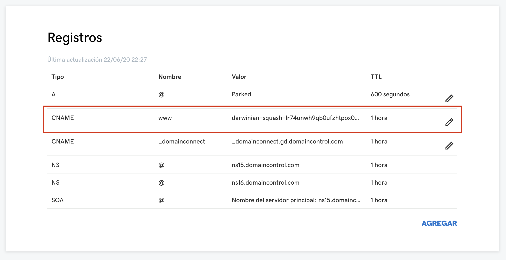

# Ejemplo 3 - últimos pasos

## Objetivo

Conocer y comprender los fundamentos de conceptos como dominio, DNS y configuraciones iniciales para conectar una aplicación.

## Requerimientos

Contar con el código de la API en una cuenta de github y una cuenta en Heroku.

Contar con un dominio y llaves de acceso a su configuración DNS. 

Es recomendable que la clase se ponga de acuerdo para registrar un dominio y pagarlo entre todos o que el experto tenga preparado ya un dominio.

## Desarrollo

### Glosario:

- **Dominio:** Un dominio (domain name) es e, nombre que utilizamos para acceder a una app por medio de palabras y no una dirección IP.  Por ejemplo, www.tudominio.com
- **Subdominio:** un dominio base como [tudominio.com](http://tudominio.com) puede tener prefijos cómo [dany.tudominio.com](http://dany.tudominio.com) o el mismo www.tudominio.com. Estos pueden ser referidos a una app totalmente diferente.
- **DNS:** (Domain Name System) o sistema de nombres de dominio
- P**roveedor DNS:** La empresa que nos proporciona servicios de gestión de los archivos de configuración de nuestro dominio, y, comunmente  también nos permite registrar y gestionar nuevos dominios.

### Conectar un dominio

Para llevar a la práctica el siguiente ejercicio, es probable que necesites una tarjeta de crédito o débito. En caso de no contar con ella no debes preocuparte, estar atento a la parte teórica es suficiente.

Al hacer deploy de nuestra aplicación, heroku automáticamente le asigna un dominio personalizado a nuestra API.

Para configurar un dominio personalizado con Heroku primero debemos de tener un dominio registrado y acceso a sus archivos de configuración DNS.

1. Para registrar un dominio puedes acudir a distintas empresas registrantes y pagar por el nombre de un dominio. Como recomendación puedes utilizar [Google domains](https://domains.google.com/), [namecheap](https://www.namecheap.com/) o Godaddy.

    

2. En tu aplicación de Heroku, dirígete a settings y en la sección de Domains y añade el dominio que registraste.

    

3. Accede a la configuración DNS de tu dominio por medio de tu proveedor.
4. Configura un nuevo subdominio para tu api agregando un nuevo registro sintético, el siguiente es un ejemplo de cómo hacer esto en Google Domains.

    

    Para Godaddy, Modifica el registro CNAME que tiene como host "www"

    

5. Espera a que los cambios se vean reflejados.
6. Una vez hecho esto accede al dominio de tu API

### Ejercicio 3

Investiga para qué sirve un certificado SSL y las ventajas que tiene para tu aplicación.

Configura un certificado SSL.

Pistas:

- Googlea y revisa algunas alternativas para configurar esto con Heroku y tu proveedor DNS.
- [https://github.com/nodenica/node-heroku-ssl-redirect](https://github.com/nodenica/node-heroku-ssl-redirect)
- También puedes investigar cómo funcionan herramientas como Letsencrypt, para obtener certificados de manera gratuita.