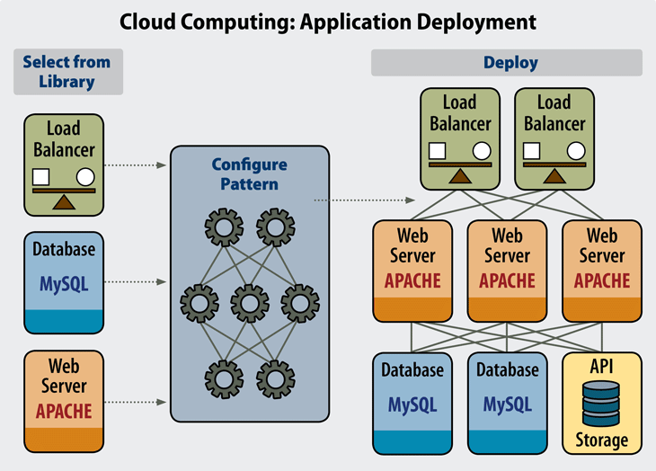

# Prework

## Objetivo

Comprender el concepto de Deploy, y conocer algunos servicios para publicar nuestra API.

## Instrucciones

Leer los siguientes artículos y posteriormente contestar el cuestionario adjunto.

## Desarrollo

Es común que las responsabilidades de un *backend developer*  también incluyan la parte de implementación y mantenimiento de la infraestructura que soportará nuestro producto de software. Por eso es importante que conozcas términos y opciones para hacer el lanzamiento de una aplicación a producción.

Algunos términos comunes son:

### Production (Producción)

"Poner software en producción" ó "subir a producción", son términos que se utilizan para referirnos a poner una API o app de manera disponible para los usuarios, lista para usarse.

### Environments / ambientes

Hasta ahora hemos desarrollado en un ambiente de 'development' (evidentemente), pero las configuraciones de una aplicación son diferentes según sea el ambiente dónde se esté ejecutando. 

En cualquier organización con productos de software se tienen dos ambientes; *development y production*. También es común encontrar tres; ***development, producción y staging***. Dónde el tercero se refiere a un ambiente intermedio donde distintos desarrolladores pueden hacer pruebas de integración con otros componentes y partes del sistema. El ambiente de **staging** es muy útil para trabajar en equipo y probar nuevas funcionalidades antes de hacerlas disponibles para todos los usuarios.

### Deployment

En pocas palabras, el término *deployment* se refiere a todos los conceptos y actividades que se relacionan con el lanzamiento de un proyecto de software disponible para los usuarios.

Hacer *deploy* es de cierta forma **publicar** nuestra aplicación, o en nuestro caso, nuestra API. Pero el deployment puede abarcar mucho más que únicamente poner disponible a todo el mundo una aplicación, ya que dependiendo los requerimientos de un proyecto, es posible que sea necesario hacer un lanzamiento en una red privada o con ciertas restricciones.

El deployment implica preparar todos los sistemas necesarios para poder estar seguros de que nuestro sistema será estable cuándo sea utilizado por nuestros usuarios.

Diagrama de ejemplo de una aplicación en la nube.

### La nube

La definición de la nube puede parecer poco clara, pero, básicamente, es un término que se utiliza para describir una red mundial de servidores, cada uno con una función única. La nube no es una entidad física, sino una red enorme de servidores remotos de todo el mundo que están conectados para funcionar como un único ecosistema.

Hace algunos años aún era común que para publicar un servicio web tuvieses que comprar o construir un servidor desde cero. Esto incluía desde el decidir la capacidad necesaria de los componentes de hardware y conseguirlos, hasta la planeación de la arquitectura para el cuarto de servidores con la ventilación adecuada y soporte para una conexión a internet y a una red eléctrica estable.

Gracias a la nube hoy existen demasiados servicios en línea para poder lanzar software. Las opciones van desde los servicios más sencillos y con capa gratuita cómo [Heroku](https://www.heroku.com/) y [Netlify](https://www.netlify.com/), hasta proveedores más grandes con datacenters al rededor del mundo.

Los tres principales proveedores de servicios web en la nube son Amazon Web Services, Google Cloud y Microsoft Azure. El catálogo de diferentes servicios se ha vuelto demasiado extenso para cada proveedor, y actualmente además de proveer infraestructura de redes, bases de datos y máquinas virtuales y almacenamiento también ofrecen servicios avanzados para Machine Learning, ciencias de datos y desarrollos específicos de los productos de cada empresa.

Para visualizar de manera general las ofertas de los principales provedores de servicios cloud, lee el siguiente artículo.

[AWS vs Azure vs GCP: todos los servicios cloud frente a frente](https://www.paradigmadigital.com/dev/comparativa-servicios-cloud-aws-azure-gcp/)